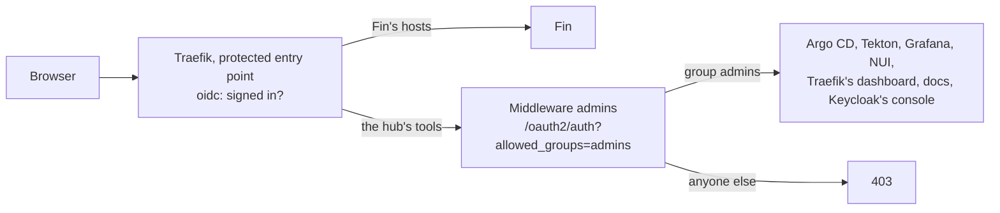

# Admins only

**Decision**: The hub's tools admit only group `admins`. Each tool's route adds Middleware `admins`, a ForwardAuth to
oauth2-proxy's `/oauth2/auth?allowed_groups=admins`, after the protected entry point's sign-in: a signed-in user outside
the group gets 403. Fin's hosts admit every signed-in user, Fin's test users included. Keycloak's pods also admit
namespace `ci-fin`, whose end-to-end runs create and delete those test users through the admin API.

## Why

- Fin's end-to-end suite signs in as test users that its runs create in realm `hub`, from any of Fin's branches
  ([test users](../../infra/designs/test-users.md)).
- Until now everyone realm `hub` signed in was a person Terraform declares. Every one of them was an Argo CD admin
  (`policy.default: role:admin`), a Grafana admin (`auto_assign_org_role: Admin`), an editor in the Tekton Dashboard
  (`readonly: false`), and could open NUI, the Traefik dashboard and the docs site. A test user must reach none of them.

## Design

| Route | Middleware `admins` in | Order |
| --- | --- | --- |
| `argocd.dev.kfirs.com` | `argocd` | Before `id-token` |
| `tekton.dev.kfirs.com` | `tekton-pipelines` | The rule's only filter |
| `grafana.dev.kfirs.com` | `grafana` | The rule's only filter |
| `nui.dev.kfirs.com` | `nats` | Before `strip-cookies`, which removes the session cookie that `admins` reads |
| `traefik.dev.kfirs.com` | `traefik` | The dashboard's IngressRoute, through the chart's `ingressRoute.dashboard.middlewares` |
| `docs.dev.kfirs.com` | `docs` | The rule's only filter; `legal.kfirs.com` stays public |
| `admin.id.kfirs.com` | `keycloak` | The console's rule |
| `id.kfirs.com/realms/master` | `keycloak` | After `oidc`; `/realms/hub` and `/resources` stay public, for the login page |

oauth2-proxy reads the user's groups from the ID token's `groups` claim, which client `hub` carries
([test users](../../infra/designs/test-users.md)). Keycloak's NetworkPolicy (the `keycloak` resource's
`networkPolicy.http`) admits `traefik`, `ci-infra` and now `ci-fin`, on port 8080.

## Decisions

| Decision | Why | Rejected |
| --- | --- | --- |
| A Middleware per route, after the entry point's sign-in | The entry point's ForwardAuth starts the sign-in for anyone without a session; `/oauth2/auth` answers 401 instead of starting it, so it can only follow. Fin's hosts share the entry point, so the check can't live there | The group check on the entry point: Fin's test users would be refused too |
| A copy in each namespace | A Gateway API route's `ExtensionRef` names a Middleware of its own namespace only | One Middleware in `traefik` |
| Every tool, the docs site included | Test users need only Fin. The docs site serves CI reports, whose traces hold what tests typed | Argo CD's RBAC alone: Grafana, the Tekton Dashboard and NUI would stay open |
| The tools' own roles stay as they are | Only admins reach them now | Argo CD roles from groups now (Keycloak's design lists it for later) |
| Keycloak admits `ci-fin` | The admin API has no public route; the runs reach it in the cluster, as Terraform does from `ci-infra` | A public admin route |

## Security and failure modes

- **This change needs the groups claim first.** Merged before Keycloak sends `groups`, it would answer 403 to everyone,
  the owner included, on every tool. It merges after infra's change is applied and a fresh sign-in shows
  `groups: ["admins"]` in the ID token. A session from before the claim gets it at its next refresh, within 5 minutes.
- **A lockout is fixed through Git.** Argo CD syncs this repository whatever its UI admits, so reverting the change
  reopens the tools; `kubectl` through the GKE DNS endpoint still reaches the cluster.
- **Test users reach Fin, and only Fin.** Any of Fin's branches can create one, so nothing else may trust "signed in to
  the hub" alone: a new tool needs Middleware `admins` (CLAUDE.md).

## Rollout

| Step | Where | What |
| --- | --- | --- |
| 1 | `infra` | Groups `admins` and `fin-e2e`, the groups claim, client `fin-e2e` ([test users](../../infra/designs/test-users.md)) |
| 2 | Check | A fresh sign-in's ID token carries `groups: ["admins"]` |
| 3 | `delivery` | This change |
| 4 | Check | Each tool opens for the owner; a member of `fin-e2e` gets 403 on each, and Fin opens for it |
